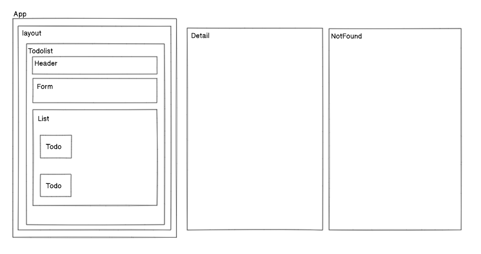

컴포넌트를 나누는 기준은 기존 투두 리스트와 비슷하게 나누었습니다

위 사진과 같은 형태로 컴포넌트를 위치시켰습니다.

APP에서 라우터를 이용하여 Layout, Detail, NotFound 이 세 경로로 나누었고 
Todo에 있는 자세히 보기를 누르면 해당 아이디 값을 가지는 Detail 로 이동하게 되고

경로가 맞지 않는다면 NotFound 페이지로 이동하여 뒤로 되돌아갈수 있습니다.

이 브랜치는 깃 연습용입니다
깃 prac